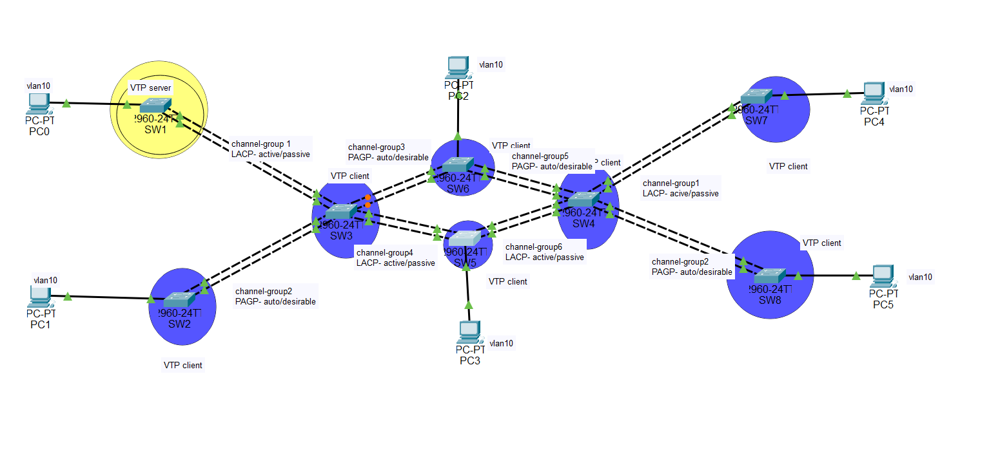

# Advanced Switching Network Project

## Project Description
This repository contains the files for a network switching project built using Cisco Packet Tracer. The project demonstrates the practical application of core switching technologies including VLANs, VTP, EtherChannel (Link Aggregation), and Port Security in a simulated network environment.

## Technologies Implemented
*   **VLANs (Virtual Local Area Networks):** Segmenting the network into broadcast domains.
*   **VTP (VLAN Trunking Protocol):** Centralized management of VLANs across switches (configured in Server/Client mode).
*   **EtherChannel (Link Aggregation):** Bundling multiple physical links into a single logical link for increased bandwidth and redundancy, using both LACP and PAgP protocols.
*   **Port Security:** Enhancing network security by restricting access on switch ports based on MAC addresses.
*   **Basic Switch Configuration:** Hostnames, banners, password security, etc.

## Network Topology
The project is based on a topology consisting of 8 Cisco 2960 switches and 6 PCs. The switches are interconnected using EtherChannel links for redundancy and performance. Edge switches are connected to PCs via access ports.

 

*   **SW1:** Configured as the VTP Server.
*   **SW2-SW8:** Configured as VTP Clients.
*   EtherChannel groups are configured between switches using different modes (LACP Active/Passive, PAgP Auto/Desirable).
*   PCs are connected to access ports configured within VLAN 10.

## Project Objectives
The primary objective of this project was to gain practical experience in configuring and verifying fundamental advanced switching concepts studied theoretically. This included:
*   Setting up a multi-switch network topology.
*   Implementing VTP for efficient VLAN distribution.
*   Creating and assigning VLANs to network devices.
*   Configuring EtherChannels using both LACP and PAgP.
*   Applying Port Security to access ports.
*   Verifying the operation and interaction of these technologies.
*   Practicing efficient configuration methods using text editors.

## Implementation Details

### Configuration Workflow
Configurations were primarily scripted using a text editor (like Notepad) and pasted onto the switch CLI to save time and ensure consistency across multiple devices.

### Key Configurations
*   **VTP:** Domain `abcd.com`, Password `Deakin@123`, Version 2. SW1 is the server, others are clients.
*   **VLANs:** VLAN 10 (HR), VLAN 20 (ICT), VLAN 30 (Finance) were created on the VTP server (SW1).
*   **EtherChannel:**
    *   Channel-group 1: LACP Active/Passive
    *   Channel-group 2: PAgP Auto/Desirable
    *   Channel-group 3: PAgP Auto/Desirable (used, e.g., between SW3 and SW6/SW4 as shown in the image)
    *   Channel-group 4: LACP Active/Passive
    *   Channel-group 5: PAgP Auto/Desirable
    *   Channel-group 6: LACP Active/Passive
    *   All Port-Channel interfaces were configured as trunks (`switchport mode trunk`) to carry VLAN traffic and VTP updates.
*   **Access Ports:** Interfaces connected to PCs are configured as access ports (`switchport mode access`) and assigned to the appropriate VLAN (VLAN 10 in this case).
*   **Port Security:** Applied to access ports with a maximum of 2 secure MAC addresses (`switchport port-security maximum 2`), configured to learn addresses dynamically (`switchport port-security mac-address sticky`), and set to `shutdown` mode on violation (`switchport port-security violation shutdown`).

## Configuration Files
The full configuration commands for each switch can be found in the `configs` directory:
*   [`configs/SW1_running_config.txt`](configs/SW1_running_config.txt)
*   [`configs/SW2_running_config.txt`](configs/SW2_running_config.txt)
*   [`configs/SW3_running_config.txt`](configs/SW3_running_config.txt)
*   [`configs/SW4_running_config.txt`](configs/SW4_running_config.txt)
*   [`configs/SW5_running_config.txt`](configs/SW5_running_config.txt)
*   [`configs/SW6_running_config.txt`](configs/SW6_running_config.txt)
*   [`configs/SW7_running_config.txt`](configs/SW7_running_config.txt)
*   [`configs/SW8_running_config.txt`](configs/SW8_running_config.txt)

These files contain the output of the `show running-config` command from each device after the configuration was completed.

## Verification
Key commands used to verify the configuration include:
*   `show vlan`
*   `show vtp status`
*   `show etherchannel summary`
*   `show port-security`
*   `show port-security interface [interface-id]`
*   `ping` tests between PCs in the same and different VLANs.

## Challenges and Learnings
*   Identifying and correctly configuring interface ranges for EtherChannel and access ports.
*   Ensuring consistent VTP settings (domain, password, version) across all switches.
*   Matching LACP and PAgP modes correctly on connecting switches for EtherChannel formation.
*   Understanding the limitations of Packet Tracer (e.g., the maximum number of EtherChannel groups).
*   Recognizing the importance of `logging synchronous` to avoid command interruption.
*   Confirming that VLANs correctly isolate broadcast traffic.

## Requirements
To open and interact with the network simulation, you need to have **Cisco Packet Tracer** installed.

## Files in this Repository
*   `network_project.pkt`: The main Cisco Packet Tracer file.
*   `README.md`: This file.
*   `images/`: Directory containing topology images.
*   `configs/`: Directory containing individual switch configuration files.
